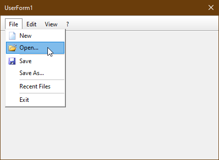

# XL_Menubar  
## A Cool Looking Menubar On A Userform in Excel  

 

Project started in february 2023.  
This example shows how to implement a menubar on a userform in excel.  
We have a class Menubar a class MenubarItem and a class MenuItem.
On the Userform we have a Frame-control on the frame control we have some Image and Label-controls working as Menubaritems.
The class Menubar holds and manages the Frame-control and all MenubarItem-objects and paints it due to the users mouse-actions.
The class MenubarItem holds and manages the Frame-control for the menuitems and all the Menuitem-objects and paints it due to the users mouse-actions.
The class MenuItem holds and manages an Image-control and a Label-Control and draws it due to the users mouse actions.

